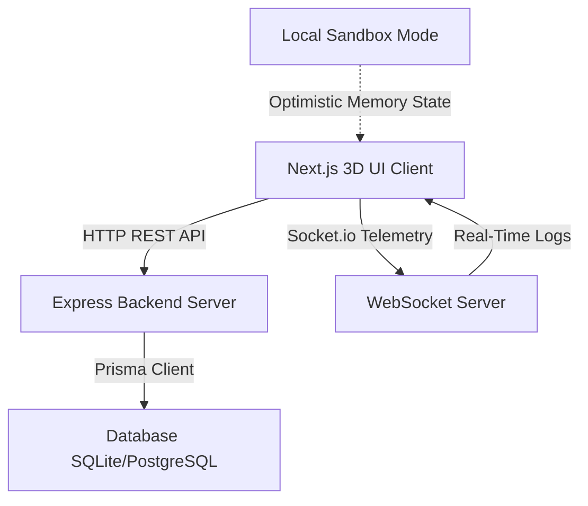

# MindMesh 🧠🛰️
### *Real-Time 3D AutoML Visual Pipeline Builder & Interactive MLOps Sandbox*

MindMesh is a next-generation web application designed to democratize machine learning workflows. It provides a visual, interactive 3D playground for building, tuning, evaluating, and deploying machine learning pipelines. Whether running fully synchronized with a backend database or operating as a lightweight client-side **Local Sandbox**, MindMesh delivers a high-fidelity visual experience for data scientists and ML engineers.

---

## 🚀 Key Features

### 1. 🌌 Interactive 3D Pipeline Graph Visualizer
* **Trigonometric 3D Projection:** Nodes are plotted and rotated dynamically in 3D perspective space using vector projection algorithms.
* **Liquid Spring-Force Physics:** Implements Hooke's Law physics calculations (`F = -k * x`) to ensure nodes repel each other gently and slide smoothly during collisions without rigid snapping.
* **Drag-Aware Position Locking:** Dynamically maps 2D mouse coordinates back to 3D space based on camera angle and zoom. Dragged nodes stay locked directly under the mouse pointer while neighboring nodes dynamically slide out of the way.
* **📐 1-Click Auto-Align:** Automatically structures disorganized layouts into a neat, non-overlapping workflow DAG (Directed Acyclic Graph) sorted into structured columns (`Ingest` ➔ `Preprocess` ➔ `AIModel` ➔ `Output`).
* **⚡ Physics Engine Toggle:** Dynamically toggle the custom spring-force physics engine ON/OFF in real-time, allowing users to manually float nodes freely or enforce dynamic collision boundaries.

### 2. 📊 Interactive AutoML Benchmarks Leaderboard
* **Multi-Algorithm Evaluation:** Evaluates multiple regression models (including XGBoost, Decision Trees, and Linear Regressors) on the active dataset constraints.
* **Dynamic Performance Dashboards:** Compiles visual progress metrics comparing $R^2$ scores, Mean Squared Error (MSE), and fit duration in real-time.
* **Champion Model Recognition:** Automatically identifies and highlights the best-performing model based on $R^2$ performance metrics.

### 3. 🎯 3D Hyperparameter Space Plotter
* Plots training runs in a rotating 3D Bayesian Optimization space.
* Color-maps trials based on accuracy (green for high performance, violet for low).
* Interactive viewport rotation using mouse drag.

### 4. ⚡ Live API Inference Playground
* **Speedometer Output Gauge:** Predict target vectors in real-time using range sliders. The output is visually mapped on a speedometer-style Gauge SVG.
* **Dynamic API Snippet Generator:** Instantly copies ready-to-run integration snippets in `cURL`, `Python (requests)`, and `JavaScript (fetch)` for remote client execution.

### 5. 📡 Telemetry Channel & Local Sandbox Mode
* **Rebranded Telemetry Status:** Top header indicates WebSocket status dynamically (green `Sync Active` when online, teal `Local Sandbox` when running database-free).
* **Live WebSocket Console Log:** Renders streaming backend execution telemetry in a terminal emulator.

---

## 🛠️ Technology Stack

* **Frontend:** Next.js (React), Tailwind CSS v4, Lucide React, HTML5 Canvas 2D Context (for high-performance high-FPS 3D render loops).
* **Backend:** Node.js, Express, Socket.io (WebSockets).
* **Database & ORM:** Prisma ORM with SQLite (supports zero-setup PostgreSQL fallback).

---

## 🏗️ System Architecture



---

## 🏁 Quick Start & Installation

### Prerequisites
* **Node.js** (v18.x or above)
* **npm** or **yarn**

### 1. Repository Setup
```bash
git clone https://github.com/Mridul-code-maker/MindMesh.git
cd MindMesh
```

### 2. Run Backend Server
```bash
cd backend
npm install

# Initialize Database Schema & Migrations
npx prisma migrate dev --name init

# Seed default pipelines and dataset nodes
node prisma/seed.js

# Start the API & WebSockets server
npm run dev
# Server will launch on http://localhost:5000
```

### 3. Run Frontend Client
```bash
cd ../frontend
npm install

# Build & Run in Developer Mode
npm run dev
# Client will launch on http://localhost:3000
```

---

## 🎨 Design System
MindMesh integrates a theme-adaptive HUD visual layout:
* **Dark Mode:** Deep space aesthetics using slate/teal accents (`#0f172a`, `#0d9488`).
* **Light Mode:** High-contrast floating card layouts. Canvas cards use a custom **Rich Charcoal (`#27272A`)** background, off-white readability texts, and sky-blue borders (`#38BDF8`) to float clearly over a white blueprint grid.

---

## 📐 Auto-Align Layout Logic Details
When nodes are added or rearranged, clicking the **Auto-Align** button resolves positions via the following grid column layout calculation:

$$\text{X Position} = (\text{Column Index} - 1.5) \times 160$$
$$\text{Y Position} = (\text{Index in Column} - \frac{N - 1}{2}) \times 85$$

This ensures symmetrical vertical spacing centered around zero, completely eliminating overlapping nodes on the visualizer canvas.
